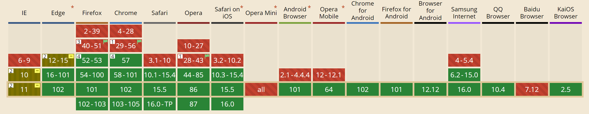
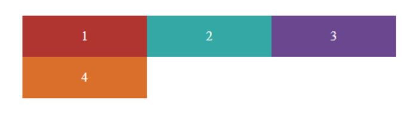
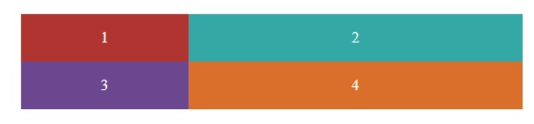
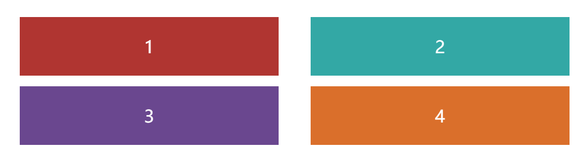
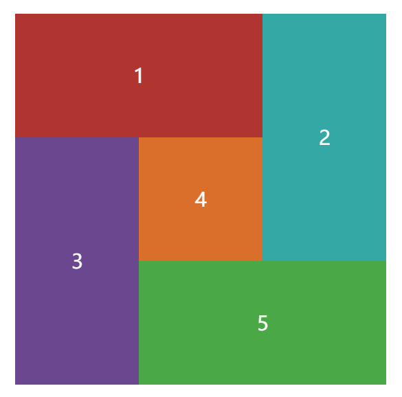

# CSS Grid（网格布局）

> 目前为止最强大的`CSS`布局方案

  
`Grid`布局与`Flex`布局都可以快速便捷的给子元素分配布局位置，但是两者还是有一定的差别：

- `Flex`以轴线布局，只有一条主轴，属性是将子元素根据主轴进行布局，是`一维布局`;
- `Grid`的属性是将容器划分为行`row`与列`column`，有两条轴，是二维布局，对于上图中较为复杂的布局，使用`Grid`会比`Flex`方便得多，`Grid`只需要创建一个容器，而`Flex`只能通过嵌套来实现。


数据来源：https://caniuse.com/?search=grid

## 一、基本概念

### 1.元素

采用网格布局的元素区域称为容器`container`；容器内的子元素称为项目`item`。

```html
<div>
  <!-- This is container -->
  <p>item1</p>
  <p>item2</p>
  <p>item3</p>
</div>
```

和`Flex`一样，只有容器元素的子元素才是项目。

### 2.行、列、单元格、网格线

> 就像一个 Excel

既然是二维布局，它就像表格一样，拥有行`row`与列`column`以及对应的`CSS属性`；  
行与列交叉形成单元格`cell`，划分单元格之间的线，则被称为网格线`grid line`。

## 二、属性

`Grid`布局分别针对容器与项目拥有两套属性。  
想要让元素使用`Grid`布局，需要在要定义为容器元素的样式中设置`display:grid`（或行内布局`inline-grid`）。

### 1.容器属性

#### 1.1 grid-template-<columns|rows>

##### （1）基本使用

该属性用于划分网格布局的行与列。


```css
.container {
  display: grid;
  grid-template-columns: 50% 50%;
  grid-template-rows: 50% 50%;
}
```

##### （2）repeat(循环次数, 循环规则)

像乘法一样，可以规定重复的值，（1）中的代码便可以优化成：

```css
.container {
  display: grid;
  grid-template-columns: repeat(2, 50%);
  grid-template-rows: repeat(2, 50%);
}
```

循环规则可以是一类模式：

```css
.container {
  /* 共6列，每3列按照50% 40% 30%模式排列 */
  grid-template-columns: repeat(2, 50% 40% 30%);
}
```

##### (3) auto-fill 关键字

自动填充。用于单元格大小固定、容器大小不确定的情况，元素会尽量填充单元格。

```css
.container {
  grid-template-columns: repeat(auto-fill, 150px);
}
```



##### (4) fr 关键字

`fraction`：片段
表示比例关系。

```css
.container {
  grid-template-columns: 1fr 2fr;
}
```



也可以与绝对单位结合使用

```css
.container {
  grid-template-columns: 100px 1fr 2fr;
}
```

##### (5) minmax()

minmax(最小值, 最大值)

##### (6) auto 关键字

浏览器自动决定

##### (7) 网格线名称

`grid-template`属性中，在单元格外可以用中括号表示网格线，中括号内容即为网格线名称

```css
.container {
  display: grid;
  grid-template-columns: [c1] 100px [c2] 100px [c3] auto [c4];
  grid-template-rows: [r1] 100px [r2] 100px [r3] auto [r4];
}
```

#### 1.2 grid-<row|column>-gap、grid-gap

`gap`属性设置单元格间距
`grid-gap`统一设置间距：`grid-gap:行间距 列间距`；若只写一个值，则为行列间距。

```css
.container {
  grid-gap: 10px 30px;
}
```



#### 1.3 grid-auto-flow

决定容器子元素排列规则，默认为`row`

- `row` 默认 先行后列
- `column` 先列后行
- `row dense` 先行后列，但尽量填满行再换行
- `column dense` 先列后行，但尽量填满列再换列

#### 1.4 <justify|align|place>-content

与`flex`布局对应属性的概念类似

- `justify-content` 定义容器内容的水平位置；
- `align-content` 定义容器内容的垂直位置；
- `place-content` 为复合写法：`place-content: align justify`

属性值：

- `start` 左对齐/顶部对齐
- `end` 右对齐/底部对齐
- `center` 居中
- `stretch` 拉伸，占满整格
- `space-around` 两侧间隔相等
- `space-between` 两边对齐
- `space-evenly` 间隔相等

#### 1.5 <justify|align|place>-items

与`flex`布局对应属性的概念类似

- `justify-items` 定义单元格内容的水平位置；
- `align-items` 定义单元格内容的垂直位置；
- `place-items` 为复合写法：`place-items: align justify`

属性值：

- `start` 左对齐/顶部对齐
- `end` 右对齐/底部对齐
- `center` 居中
- `stretch` 拉伸，占满整格

#### 1.6 grid-auto-<columns|rows>

如果项目位置超出了已定义的网格内容，浏览器会在其周围生成空白网格区域来填补整个网格容器，该属性用来定义生成的空白网格大小，用法与`grid-template-<columns|rows>`相同，如果不定义该属性，那么生成的新网格大小将以超出容器的项目大小为准。

### 2.项目属性

#### 2.1 grid-<column|row>-<start|end>

指定项目位置

- `grid-column-start` 项目左边所在的垂直网格线
- `grid-column-end` 项目右边所在的垂直网格线
- `grid-row-start` 项目上边所在的水平网格线
- `grid-row-end` 项目下边所在的水平网格线

网格线可以通过其顺序指定，亦可通过定义好的网格线名称指定。



```scss
.container {
  display: grid;
  grid-template-columns: repeat(3, 100px);
  grid-template-rows: repeat(3, 100px);
  grid-auto-flow: row dense;
  &__item {
    &:nth-child(1) {
      background: #b03531;
      grid-column-start: 1;
      grid-column-end: 3;
    }
    &:nth-child(2) {
      background: #33a8a5;
      grid-column-start: 3;
      grid-row-start: 1;
      grid-row-end: 3;
    }
    &:nth-child(3) {
      background: #6a478f;
      grid-row-start: 2;
      grid-row-end: 4;
    }
    &:nth-child(4) {
      background: #da6f2b;
    }
    &:nth-child(5) {
      background: #4ba846;
      grid-column-start: 2;
      grid-column-end: 4;
    }
  }
}
```
